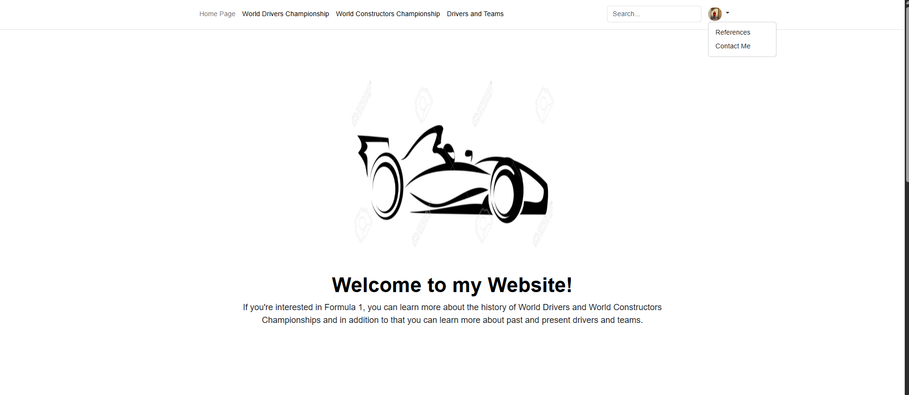
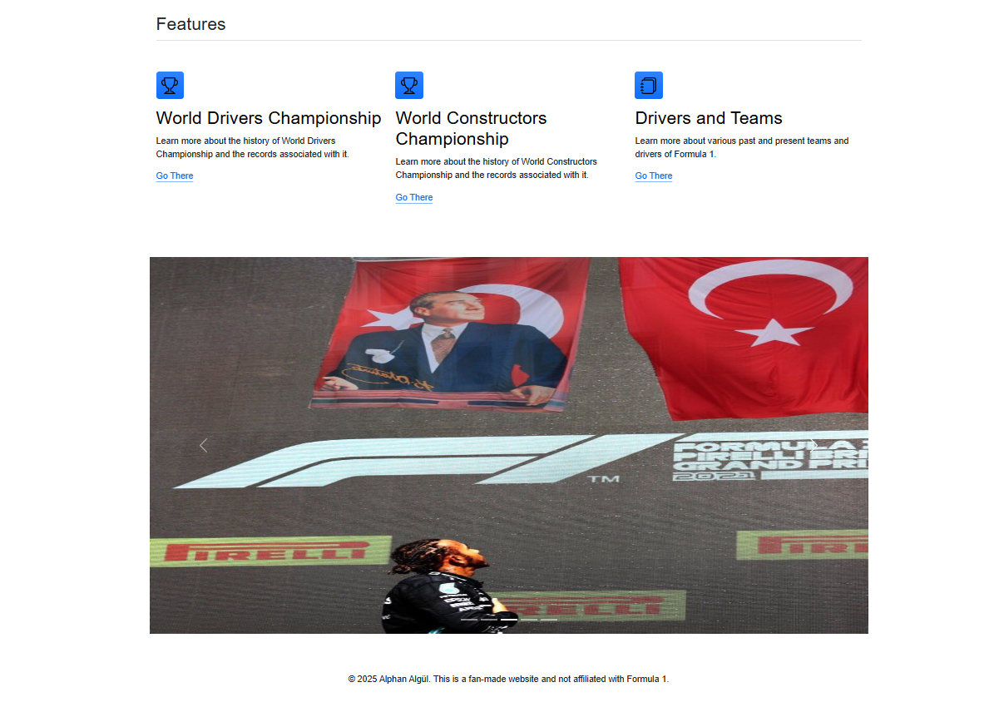
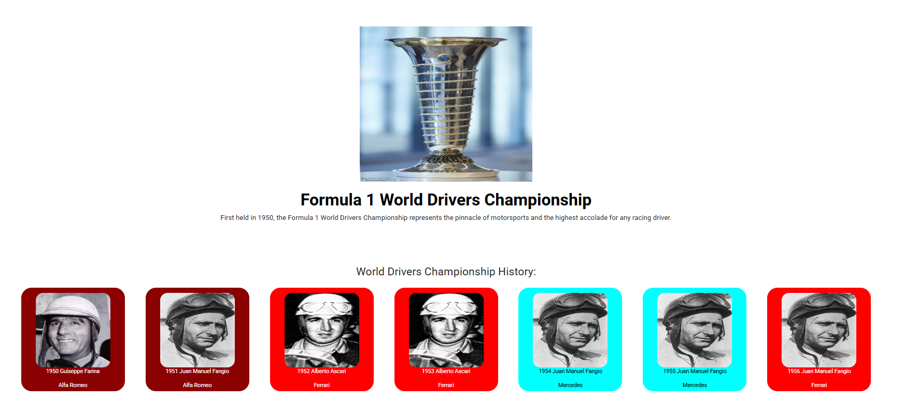
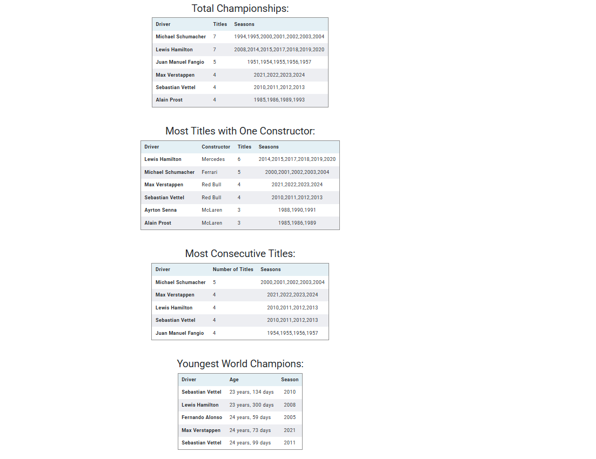
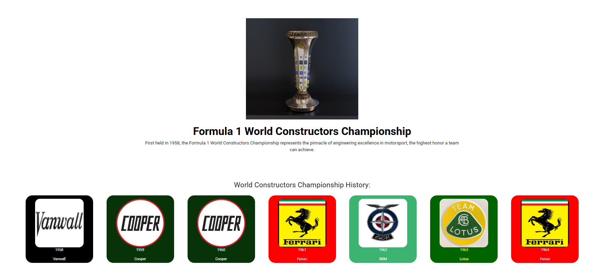
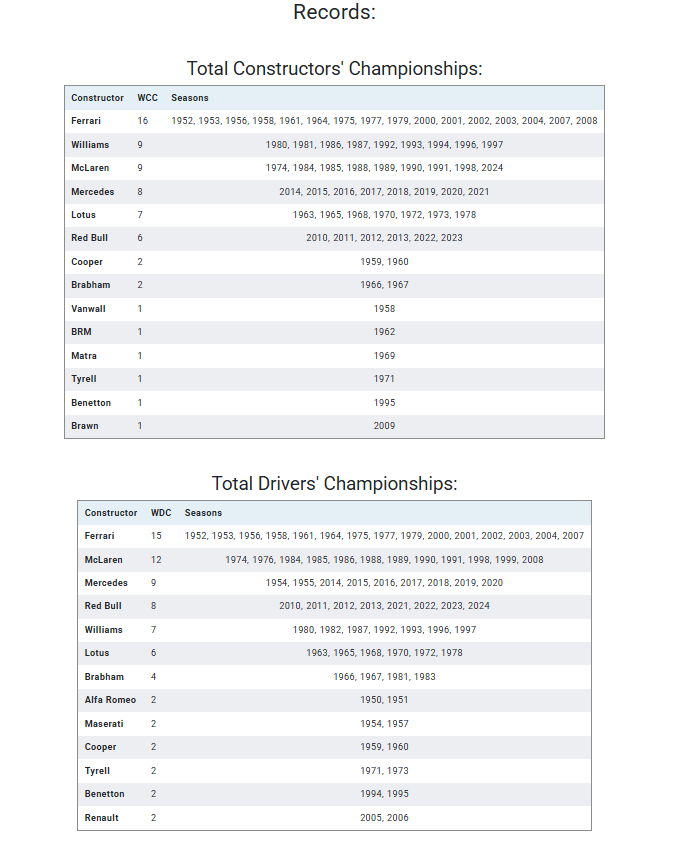
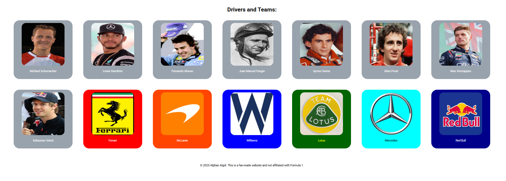
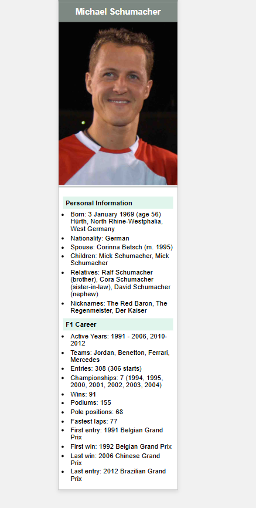
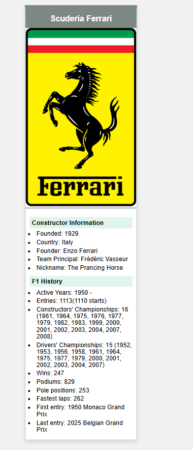
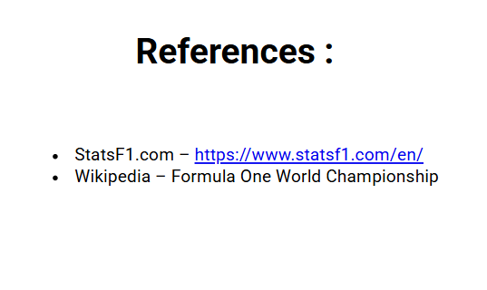

# Formula 1 History Website

A static Formula 1 information website developed using only **HTML and CSS** as a challenge.

The goal of this project was to practice building a complete multi-page website without using JavaScript, backend technologies, databases, or frontend frameworks. The website presents Formula 1 history, including World Drivers' Championship records, World Constructors' Championship records, drivers, teams, contact information, and references.

---

## Project Purpose

This project was created to improve my frontend development fundamentals by focusing on:

- Structuring pages with HTML
- Styling layouts with CSS
- Organizing images and assets
- Creating a complete multi-page static website
- Presenting historical sports data in a clean and readable format

The main challenge was to build the project using only **HTML and CSS** while still keeping the website organized, visually clear, and easy to navigate.

---

## Technologies Used

- HTML5
- CSS3

No JavaScript, backend framework, frontend framework, or database was used in this project.

---

## Features

- Multi-page static website
- Formula 1 World Drivers' Championship history
- Formula 1 World Constructors' Championship history
- Formula 1 drivers and teams section
- Championship records tables
- Image-based championship cards
- Contact page
- References page
- Custom CSS styling
- Organized project structure

---

## Interfaces

### Home Page 1



### Home Page 2



### World Drivers' Championship 1



### World Drivers' Championship 2



### World Constructors' Championship 1



### World Constructors' Championship 2



### Drivers and Teams 1



### Drivers and Teams 2



### Drivers and Teams 3



### Contact Page


### References Page



---

## Project Structure

```txt
f1website/
│
├── index.html
├── wdc.html
├── wcc.html
├── driversandteams.html
├── contact.html
├── references.html
│
├── CSS.css
│
├── Assets/
│   └── website images and assets
│
├── images/
│   └── README screenshots
│
└── README.md
